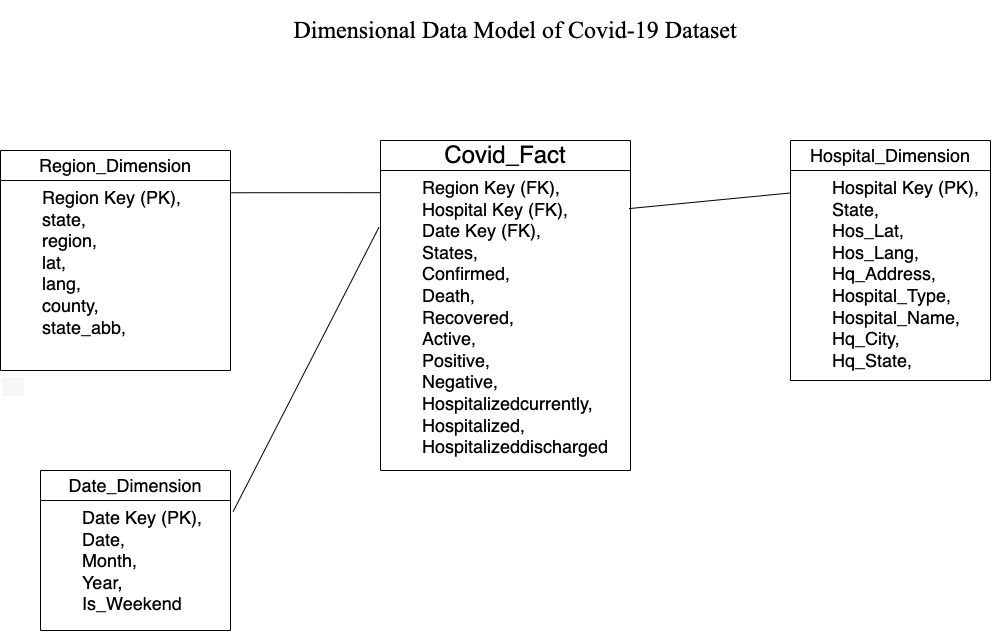

# COVID-19_data-modeling
## Overview
The goal of this project is to bulid a pipleine to convert Relational Data to Dimensional Data Model and store it in a data warehouse. This project analyzes a dataset from AWS related to COVID-19 using AWS tools. The dataset is stored in an S3 bucket and is accessed and analyzed using Athena, a serverless interactive query service. The data is transformed using Glue and is then loaded into a data warehouse Redshift for further analysis. Here is the diagram of Dimensional Data Model which is built using several relational data tables.

## Technologies Used
- AWS
- S3
- ATHENA
- GLUE
- REDSHIFT
## Process
1. The data is stored in an S3 bucket.
2. A crawler is used to load the data from S3 to Athena.
3. The data is analyzed in Athena using SQL queries.
4. Glue is used to transform the data.
5. The transformed data is loaded into a data warehouse for further analysis.
